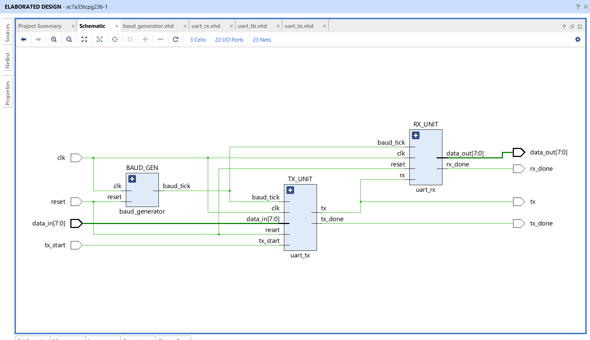

<div align="center">

# UART Communication Protocol using VHDL

### FPGA-Based UART Communication System | RTL Design | Functional Simulation | AMD Vivado 2023.2

A complete implementation of the Universal Asynchronous Receiver Transmitter (UART) protocol developed in VHDL, featuring a Baud Rate Generator, UART Transmitter, UART Receiver and Top-Level Integration. The design has been verified through behavioral simulation and synthesized for the Artix-7 FPGA.


</div>

---

# Project Overview

UART (Universal Asynchronous Receiver Transmitter) is one of the most commonly used asynchronous serial communication protocols in embedded systems.

This project presents a complete RTL implementation of UART communication using VHDL. It includes a modular design consisting of a Baud Rate Generator, UART Transmitter, UART Receiver, Top-Level Module and Behavioral Testbench.

The design has been developed and verified using **AMD Vivado 2023.2** targeting the **Artix-7 FPGA** platform.

---

# Project Highlights

- Complete UART Protocol Implementation
- Modular RTL Design
- Baud Rate Generator
- UART Transmitter (TX)
- UART Receiver (RX)
- Top-Level Integration
- Functional Simulation
- RTL Verification
- FPGA Synthesis Ready

---

# Development Environment

| Parameter | Details |
|-----------|---------|
| Language | VHDL |
| Design Tool | AMD Vivado 2023.2 |
| FPGA Family | Artix-7 |
| Device | XC7A35T |
| Design Methodology | RTL |

---

# Repository Structure

```text
UART-Protocol-VHDL
│
├── baud_generator.vhd
├── uart_tx.vhd
├── uart_rx.vhd
├── uart_top.vhd
├── uart_tb.vhd
│
├── UART_PROJECT_BLOCK_DIAGRAM.jpg
├── UART_RTL_Schematic.png
├── UART_Project_Hierarchy.png
├── UART_Implemented_Design.png
├── Simulation_Waveform.png
│
├── LICENSE
└── README.md
```

---

# System Architecture

The complete UART communication system consists of:

- Baud Rate Generator
- UART Transmitter
- UART Receiver
- Serial Communication Line


---

# RTL Schematic

RTL view generated using AMD Vivado.



---

# Functional Simulation

The UART communication was verified using Behavioral Simulation.

### Test Case

| Parameter | Value |
|----------|-------|
| Input Data | 0xAA |
| Received Data | 0xAA |
| Result | PASS |


---

# Project Hierarchy

Hierarchical view of the complete UART project.


---

# Implemented Design

Synthesized implementation generated in Vivado.


---

# Working Flow

```
Parallel Data
      │
      ▼
UART Transmitter
      │
      ▼
Serial TX Line
      │
      ▼
UART Receiver
      │
      ▼
Parallel Data Output
```

---

# Design Modules

| Module | Description |
|--------|-------------|
| Baud Generator | Generates baud tick |
| UART TX | Converts parallel data into serial format |
| UART RX | Converts serial data into parallel format |
| UART Top | Integrates all modules |
| Testbench | Performs functional verification |

---

# Simulation Results

| Verification | Status |
|-------------|--------|
| Baud Generator | PASS |
| UART Transmitter | PASS |
| UART Receiver | PASS |
| Functional Simulation | PASS |
| RTL Verification | PASS |

---

# Applications

- FPGA-Based Embedded Systems
- Digital Communication
- Serial Communication
- Embedded Hardware Design
- IoT Devices
- Industrial Automation
- Communication Protocol Learning
- FPGA Academic Projects

---

# Future Improvements

- Configurable Baud Rate
- Parity Bit Support
- Multiple Stop Bits
- FIFO Buffer
- Interrupt Support
- FPGA Board Validation

---

# Project Metrics

| Parameter | Value |
|-----------|-------|
| HDL Language | VHDL |
| RTL Modules | 5 |
| FPGA Family | Artix-7 |
| Design Tool | AMD Vivado 2023.2 |
| Functional Simulation | Completed |
| RTL Verification | Completed |
| Project Status | Completed |

---

# Author

## Rahil Nadim Khan

Electronics and Computer Engineering

---

# License

This project is licensed under the MIT License.
